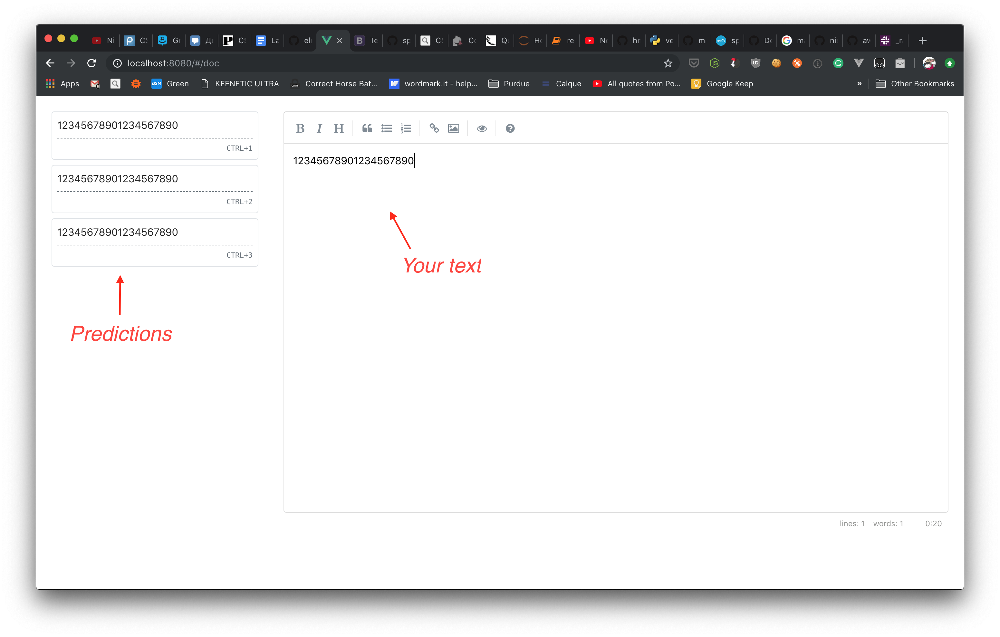

# I hate essays

## Team
1. Elnard Utiushev (eutiushe@purdue.edu)

## Description
This tool is supposed to help people like me, who often get stuck while writing 
an essay by providing smart autocomplete. It is also supposed to help writing long
and unnecessary sentences in order to increase the word count.

## Technologies
1. Frontend - Vue.js, Bootstrap
2. Backend - Node.js, Express, Socket.io
3. Prediction Service - Python, Flask, Tensorflow, scikit-learn
4. Database - MongoDB
5. Other (if I have time) - Docker

## TODO
- Frontend
  - [X] Draft 
  - [ ] Add proper routes 
  - [ ] Auth 
  - [ ] Add docs view (we need this for db req)
  - [ ] Add about view
- Backend
  - [ ] Auth (including socket.io)
  - [ ] User schema
  - [ ] Doc schema
  - [ ] Docs schema
- Prediction Service
  - [X] Setup flask
  - [X] Write an interface for prediction modules
  - [ ] Create an api
  - Prediction
    - [ ] GPT-2 
    - Markov chain
      - [ ] Find a dataset of books
      - [ ] Find/create a dataset of essays
      - [ ] Cache a markov chain  
- Other
  - [ ] Docker and docker-compose setup
  - [ ] Serve static using nginx
  - [ ] Build frontend in docker
  
## Screenshot

## TL;DR
I do not like essays
